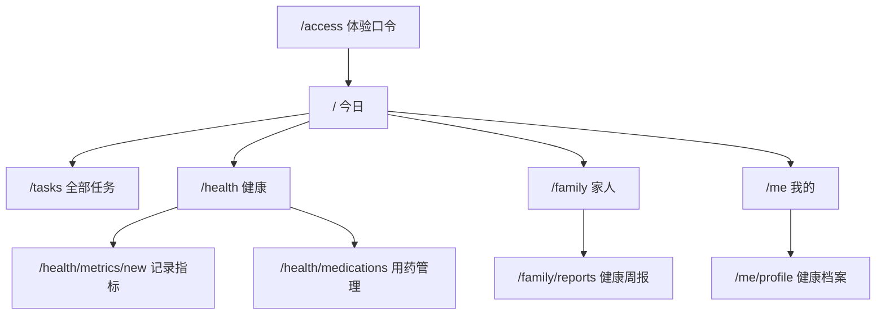
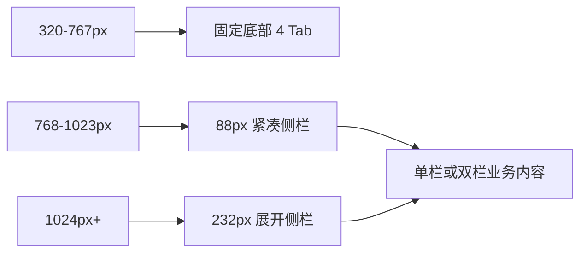
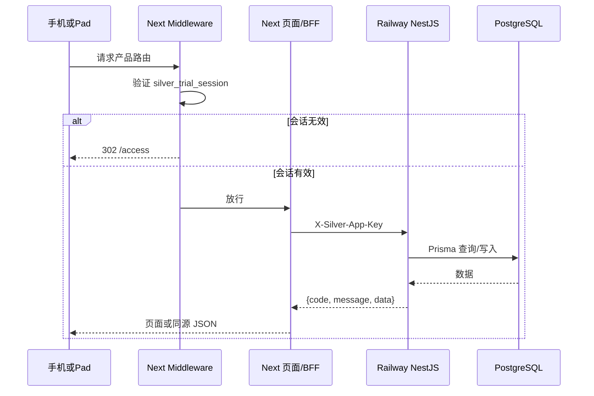
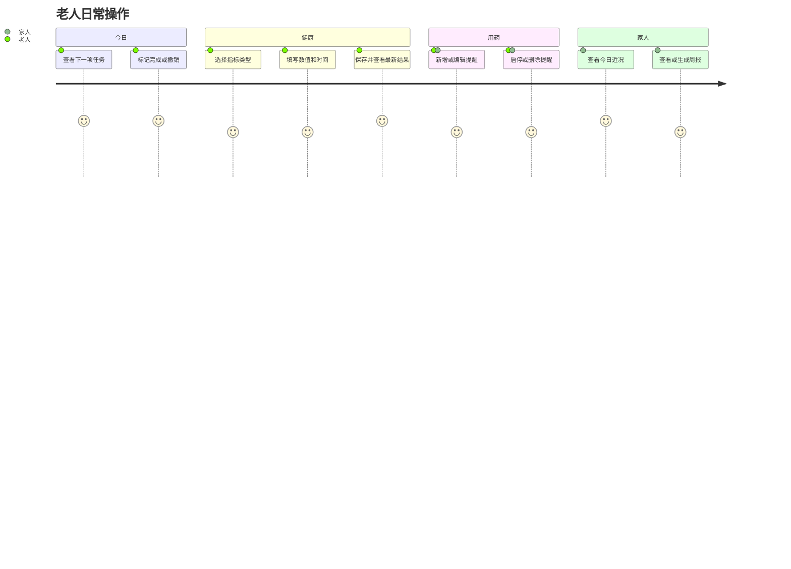

# Silver Health 移动端应用产品化技术方案

## 1. 文档目标

本方案描述 Silver Health 从演示型 H5/PWA 重构为可安装、可持续操作、可在手机与 iPad 上使用的产品体验版。当前版本使用一个受口令保护的固定体验账号，重点解决应用信息架构、真实写入、安全边界、响应式布局、PWA 离线只读和发布门禁。

本阶段明确不包含真实注册、多租户权限、短信验证码、服务端推送、原生应用商店发布、支付、医疗诊断和运营后台。

## 2. 产品信息架构



四个主 Tab 的职责：

| Tab | 核心问题 | 首屏内容 | 主要操作 |
| --- | --- | --- | --- |
| 今日 | 今天先做什么 | 下一项、进度、3 条任务预览 | 完成/撤销任务、进入全部任务 |
| 健康 | 最近健康和用药如何 | 血压/血糖/体重、趋势、今日用药 | 记录指标、管理提醒 |
| 家人 | 今天是否需要跟进 | 一句话近况、待关注项、报告和绑定 | 查看/生成周报 |
| 我的 | 当前档案和设备状态 | 档案、网络、安装、退出 | 编辑档案、安装、退出 |

旧 `/elder/*`、`/family/dashboard`、`/family/report`、`/family/bind` 和 `/demo` 保留路由兼容，但只执行重定向，不再展示旧演示页面。

## 3. 响应式应用壳



- 手机页面水平内边距为 `15px`，底部预留安全区；底部导航高度至少 `58px`。
- `768px` 起隐藏底部导航并显示侧栏；内容区同步增加左边距。
- `1024px` 起显示品牌与导航文字，业务摘要使用双栏布局。
- 内容最大宽度为 `1280px`，表单页限制为 `720px`，任务和管理页限制为 `920px`。
- 所有主要按钮至少 `48px`，所有交互目标至少 `44px`。
- 颜色、成功、警告和错误状态同时使用文字，不仅依赖色彩。

## 4. 总体技术架构



关键边界：

1. 浏览器只访问 Vercel 同源地址，不直接访问 Railway 业务 API。
2. Next Server Components 负责首屏数据；客户端写入统一访问 `/api/app/*`。
3. BFF 校验体验会话、注入固定老人 ID，并附加内部 API 密钥。
4. Railway 除 `/api/health` 外统一要求 `X-Silver-App-Key`。
5. API 或网络失败统一映射为用户可理解的中文错误，不显示数据库 ID、堆栈或英文服务异常。

## 5. 体验口令与会话

### 5.1 口令保存

- 生产环境不保存明文体验口令。
- `corepack pnpm access-code:hash -- <access-code>` 使用 `scrypt` 生成哈希。
- 哈希格式包含算法、成本参数、盐和派生结果。
- 验证使用恒定时间比较，避免直接比较派生结果字符串。
- 匿名口令请求以流式方式限制为 1KB，口令最长 128 字符；应用层按来源 IP 执行每分钟 8 次固定窗口限流，成功登录后清零。
- 生产 Vercel Firewall 对 `/api/session` 再配置全局 IP 限流；应用内限流作为纵深防护，不代替平台级规则。

### 5.2 会话令牌

- Cookie 名称：`silver_trial_session`。
- Payload 仅包含过期时间，不包含老人 ID 或敏感健康数据。
- 使用 HMAC-SHA256 签名。
- Cookie：`HttpOnly`、`SameSite=Lax`、`Path=/`，生产环境启用 `Secure`。
- 有效期：7 天。
- Middleware 验证签名和过期时间；BFF 再次验证，形成纵深防护。

### 5.3 会话接口

| 接口 | 行为 |
| --- | --- |
| `POST /api/session` | 验证 `{ accessCode }`，成功返回 204 并设置 Cookie |
| `DELETE /api/session` | 清除 Cookie；客户端同步清理页面缓存和最后同步时间 |

## 6. BFF 与 API 接口

| Web 同源接口 | Railway 接口 | 服务端注入/处理 |
| --- | --- | --- |
| `PATCH /api/app/tasks/:id` | `PATCH /api/tasks/:id/status` | 注入老人 ID，只接受 `done/todo` |
| `POST /api/app/metrics` | `POST /api/metrics` | 注入老人和录入人 ID |
| `POST /api/app/medications` | `POST /api/medications` | 注入老人 ID |
| `PATCH /api/app/medications/:id` | `PATCH /api/medications/:id` | 注入老人 ID并校验记录归属 |
| `DELETE /api/app/medications/:id` | `DELETE /api/medications/:id` | 校验记录归属，UI 删除前二次确认 |
| `PATCH /api/app/profile` | `PATCH /api/profile/elder/:id` | ID 不进入浏览器表单 |
| `POST /api/app/reports/generate` | `POST /api/reports/elder/:id/generate` | 生成当前完整周报告 |

写入成功后由 BFF 执行 `revalidatePath`：

- 任务：失效 `/`、`/tasks`、`/family`；
- 指标：失效 `/health`、`/family`；
- 用药：失效 `/health`、`/health/medications`、`/family`；
- 档案：失效 `/`、`/me`、`/me/profile`；
- 周报：失效 `/family`、`/family/reports`。

## 7. 业务交互流程



任务状态更新是幂等的：重复设置 `done` 不创建额外记录；撤销为 `todo` 时清空 `completedAt`。
重复设置 `done` 时直接返回原记录，不改写原 `completedAt`。指标写入按类型执行领域校验：血压必须同时有收缩压和舒张压，血糖必须有血糖值，体重必须有体重值，且拒绝跨类型字段组合。

## 8. PWA 与离线策略

- 静态缓存：口令页、离线页、manifest、图标，以及联网访问时加载的 `/_next/static/` 带哈希 CSS/JS。
- 页面缓存：`/`、`/health`、`/family`、`/me`、`/tasks`、`/family/reports`。
- Next RSC 响应只进入可清除的动态页面缓存，绝不进入长期静态缓存。
- 已缓存的页面与 RSC 响应采用缓存优先并后台更新，避免 iOS 独立 PWA 离线冷启动和切 Tab 等待网络超时。
- 未缓存页面采用网络优先；只有响应成功且未被重定向到 `/access` 时才写入页面缓存。
- 断网时返回最近访问页面；没有缓存时返回 `/offline.html`。
- 离线状态下任务、指标、提醒、档案和周报写操作全部禁止。
- 浏览器触发 `online` 事件且状态确实从离线恢复到在线时调用 `router.refresh()`，重新读取服务端数据。
- 离线状态卡可打开网络帮助，提供重新检测和系统设置路径；PWA 不调用 iOS 私有 URL Scheme，不能直接跳入系统网络设置。
- 不实现离线写入队列，避免重复健康记录。
- 退出体验账号向 service worker 发送 `CLEAR_APP_CACHE`，删除动态页面缓存。

## 9. 环境变量

### Vercel Web

```env
API_BASE_URL="https://silver-health-api-production.up.railway.app"
DEFAULT_ELDER_USER_ID="<railway seed elder id>"
DEFAULT_FAMILY_USER_ID="<railway seed family id>"
TRIAL_ACCESS_CODE_HASH="<scrypt hash>"
TRIAL_SESSION_SECRET="<32+ random characters>"
INTERNAL_API_KEY="<same value as Railway>"
```

### Railway API

```env
DATABASE_URL="<railway postgres url>"
PORT="3001"
CORS_ORIGIN="https://web-nu-blond-89.vercel.app"
INTERNAL_API_KEY="<same value as Vercel>"
```

任何文档、提交、构建日志都不得记录密钥和数据库密码。

## 10. 部署顺序与回滚

1. 在 Vercel 和 Railway 配置相同的 `INTERNAL_API_KEY`。
2. 在 Vercel 配置口令哈希和会话密钥。
3. 在 Vercel Firewall 为 `/api/session` 配置全局 IP rate limit。
4. 先部署 Railway API，验证 `/api/health` 公开、业务接口无密钥返回 401。
5. 再部署 Vercel Web，验证 `/access`、登录、四个 Tab 和 BFF 写入。
6. 执行受保护的 `smoke:production`。
7. 真机安装并完成一轮写入验收。

若 Web 发布失败，可回滚 Vercel 到上一部署；若 API 发布失败，应先回滚 API，再确认旧 Web 仍可访问。由于本轮无 Prisma schema 变更，不涉及数据库结构回滚。
