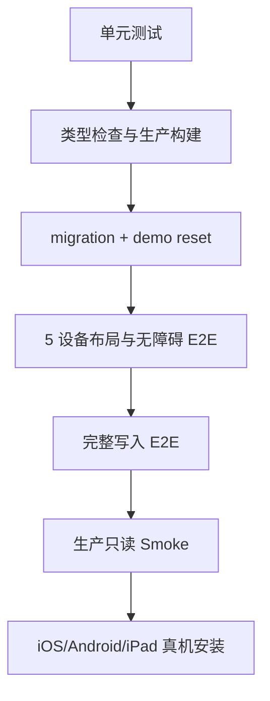
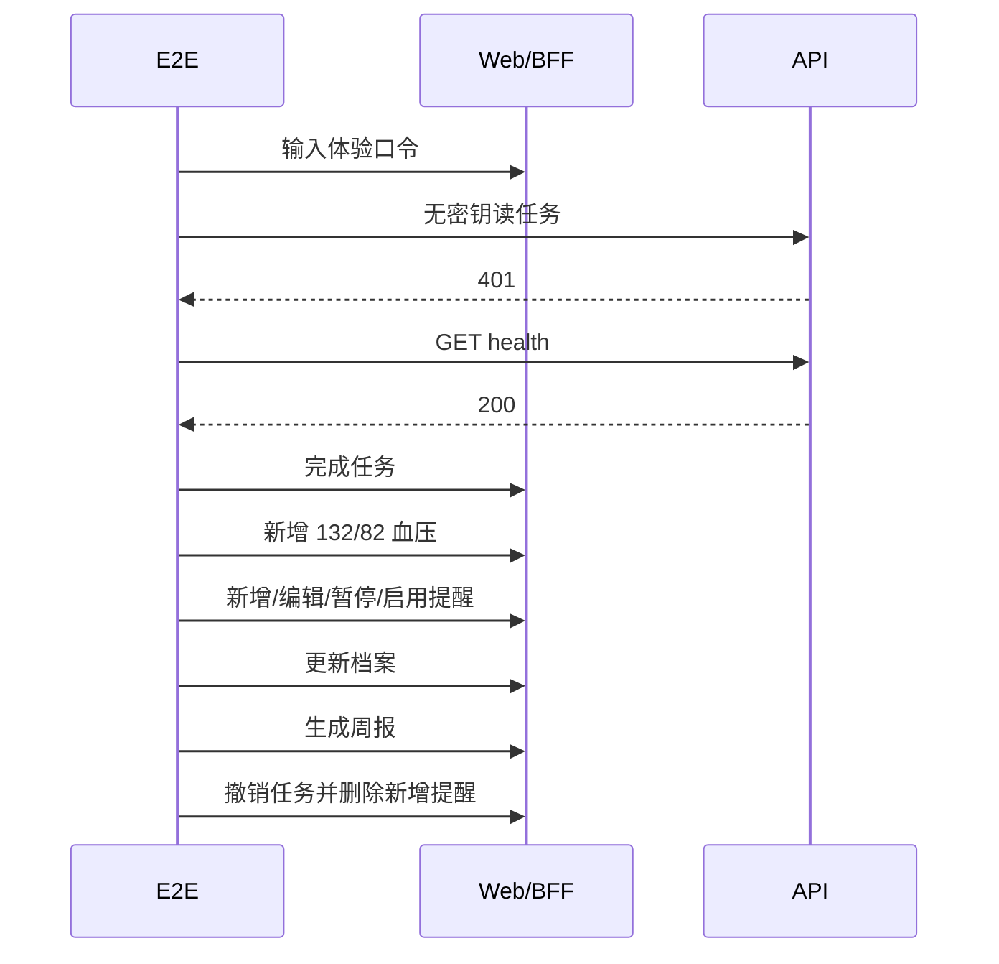

# Silver Health 移动端应用产品化测试验证方案

## 1. 测试目标

验证产品化版本满足以下条件：受口令保护、业务 API 不公开写入、手机底部四 Tab、iPad 侧边导航、核心日常闭环真实写入、PWA 可安装、离线只读、构建可发布、错误信息不泄露技术细节。

## 2. 测试分层



## 3. 环境准备

要求：

- Node.js 24+
- corepack 与 pnpm 10
- PostgreSQL 16 或兼容版本
- Chrome/Chromium
- 已安装仓库依赖

```bash
corepack enable
corepack prepare pnpm@10.0.0 --activate
corepack pnpm install --frozen-lockfile
corepack pnpm prisma:generate
```

本地根目录 `.env` 至少包含：

```env
DATABASE_URL="postgresql://user@localhost:5432/silver_health"
```

## 4. 单元测试

```bash
corepack pnpm test:unit
corepack pnpm test:local-e2e-utils
corepack pnpm test:smoke-utils
corepack pnpm test:github-workflow
```

覆盖内容：

- scrypt 口令正确/错误验证；
- 会话有效、过期、篡改和错误密钥；
- 生产环境必须配置口令哈希、匿名访问固定窗口限流和请求体大小限制；
- 内部 API 密钥缺失/错误/正确；
- 任务完成与撤销的数据更新；
- 重复完成不改写 `completedAt`，任务和用药拒绝错误老人 ID；
- 指标类型与字段组合的领域校验；
- 404、401、400、500 技术错误映射；
- 本地 E2E 主机、端口、档案 ID 和安全变量传播；
- UTC Runner 上的 seed 日期、测量时间和周范围仍按 `Asia/Shanghai` 生成；
- GitHub Actions 是否使用 PostgreSQL 服务和当前分支 E2E。

验收：退出码 0，失败数为 0。

## 5. 类型检查与构建

```bash
corepack pnpm --filter @silver-health/web typecheck
corepack pnpm --filter @silver-health/web build
corepack pnpm --filter @silver-health/api typecheck
corepack pnpm --filter @silver-health/api build
```

Web 构建路由必须包含：`/access`、`/`、`/tasks`、`/health`、`/health/metrics/new`、`/health/medications`、`/family`、`/family/reports`、`/me`、`/me/profile` 和 `/api/app/*`。

## 6. 自动化设备矩阵

| 项目 | 视口 | 导航预期 |
| --- | --- | --- |
| mobile-360 | 360x800 | 底部四 Tab |
| mobile-390 | 390x844 | 底部四 Tab |
| tablet-768 | 768x1024 | 88px 紧凑侧栏 |
| tablet-1024 | 1024x1366 | 232px 展开侧栏 |
| tablet-landscape | 1366x1024 | 展开侧栏和双栏 |

每个项目验证：

- `今日 / 健康 / 家人 / 我的` 可见且可切换；
- 只有一个 `aria-current="page"`；
- 手机隐藏侧栏，Pad 隐藏底栏；
- `scrollWidth <= innerWidth`；
- 业务按钮、输入框和导航目标高度至少 44px；
- 首页只展示 3 条任务预览；
- 页面不包含“真实 API、上线版默认体验、Silver Health PWA”等开发文案；
- axe serious/critical 问题数量为 0。

## 7. 完整本地 E2E

统一命令：

```bash
corepack pnpm test:e2e:app
```

命令自动执行：

1. `demo:reset --skip-smoke`；
2. 读取 seed 输出的老人和家人 ID；
3. 启动带 `INTERNAL_API_KEY` 的本地 API；
4. 以 `next build + next start` 启动带体验会话和服务端档案 ID 的生产模式 Web；
5. 执行 5 个设备项目共 20 条布局/无障碍用例；
6. 在 mobile-390 执行一条完整写入链路；
7. 执行 1 条生产 Service Worker 离线与缓存清理用例；
8. 无论成功或失败都停止子进程。

写入链路顺序：



## 8. PWA 与离线验证

自动检查由 `corepack pnpm test:e2e:app` 完成，覆盖：

- Service Worker 成功注册并控制页面；
- 登录后页面缓存存在；
- 静态缓存不包含带 `_rsc` 的受保护响应；
- 断网后最近访问的任务页可读；
- 离线更新任务被阻止；
- 离线状态可打开网络帮助并执行重新检测；
- 恢复联网后关闭帮助层并自动刷新服务端页面数据；
- 已缓存主 Tab 的 RSC 数据在离线切换时不等待网络超时；
- 不同 `_rsc` 查询参数仍按主 Tab 路径命中最近缓存，联网切换也先展示缓存内容；
- `GET /api/connectivity` 返回 204 且禁止缓存，实际请求失败或超时时判定离线；
- 恢复联网并退出后动态页面缓存被清除。

补充静态资源检查：

```bash
curl -I http://localhost:3000/manifest.webmanifest
curl -I http://localhost:3000/sw.js
curl -I http://localhost:3000/offline.html
```

Chrome DevTools 手工步骤：

1. 使用生产模式启动 Web；
2. Application -> Manifest，确认名称、图标、start_url、standalone；
3. Application -> Service Workers，确认 `/sw.js` activated；
4. 登录并依次访问今日、健康、家人、我的；
5. 切换 Offline 后刷新最近访问页面；
6. 确认页面可读并显示离线状态；
7. 确认写入操作不可执行；
8. 恢复网络后刷新，确认重新读取服务端数据；
9. 退出账号后确认再次访问产品路由进入 `/access`。

## 9. 真机验证

### Android Chrome

1. 打开生产 URL 并输入体验口令；
2. 浏览四个 Tab；
3. 浏览器菜单选择“安装应用”或“添加到主屏幕”；
4. 从桌面图标打开；
5. 确认无浏览器地址栏、底部安全区正常；
6. 完成一项任务并撤销；
7. 录入一条指标并在家人页确认联动。

2026-07-11 已在同一台 Xiaomi 2211133C 上使用 Chrome 150.0.7871.64 完成实际安装：

1. Chrome `Page.getInstallabilityErrors` 返回空数组，Manifest 无错误，Service Worker active；
2. Chrome 菜单显示“安装并创建快捷方式”，随后进入明确的“安装应用”确认框；
3. 安装生成 WebAPK `org.chromium.webapk.a3fbc4f1350dfafad_v2`；
4. 从桌面启动进入 `SameTaskWebApkActivity`，无浏览器地址栏；
5. `display-mode: standalone` 为 true，Manifest start_url 正确打开 `/`；
6. 独立应用内四个 Tab、激活态、无横向溢出和 44px 触控门槛均通过；
7. CDP 离线网络探针失败时，缓存的今日页和任务仍可读取，恢复网络后刷新正常；
8. MIUI 首次从桌面启动 WebAPK 时要求允许“银发健康打开 Chrome”，需选择“始终允许”；
9. 已删除测试期间创建的小米浏览器快捷方式和旧小米浏览器 PWA，桌面只保留 Chrome WebAPK 图标。

### 小米浏览器兼容性

2026-07-11 使用 Xiaomi 2211133C、Android 15、小米浏览器 Chromium 135 完成生产真机验证：

1. 体验口令登录、四个底部 Tab、主页面和二级页面均可访问；
2. 实际 CSS 视口为 `392x718`，页面宽度为 392px，无横向溢出；
3. 底部 Tab 高度为 58px，表单控件为 48px，未发现低于 44px 的可见触控目标；
4. 任务完成请求返回 200，页面和家人同步提示正常，测试任务已全部撤销并恢复为 `1/4`；
5. Manifest 无错误，Service Worker 已激活，生产页面无 4xx/5xx 和控制台错误；
6. 浏览器菜单提供“添加到桌面”，可创建 `Silver Health` 桌面图标并启动；
7. 该入口属于浏览器快捷方式，启动后仍显示小米浏览器地址栏，`display-mode` 不是 standalone；
8. 从“我的”页创建快捷方式时会保存当前 `/me` URL，不会强制采用 Manifest 的 `/` start_url；
9. 完整独立 PWA 安装仍需使用支持 Web App 安装的 Android Chrome 验证。

上述第 9 项已由 Chrome 150 真机安装结果完成；小米浏览器部分继续作为兼容性与降级行为记录。

真机网络排障记录：初次访问时本地 DNS 曾将 Vercel 域名错误解析到 Meta 地址 `31.13.73.9`。临时 `dns.google` 在当前网络不可达，设置已删除并恢复自动 DNS；恢复后生产页面可以正常访问。

### iPhone Safari

1. Safari 打开生产 URL；
2. 分享 -> 添加到主屏幕；
3. 从桌面打开并检查 standalone；
4. 检查输入框不会触发异常缩放；
5. 检查底部 Tab 不被 Home Indicator 遮挡。

2026-07-11 已使用 iPhone16,1、iOS 26.3.1 和 Safari 26.3 完成生产真机验证：

1. Safari 浏览器和添加到主屏幕后均能打开四个主 Tab，独立模式为 true；
2. 独立模式 CSS 视口为 `393x793`，无横向滚动，未发现低于 44px 的可见业务触控目标；
3. 任务完成和撤销成功，测试后恢复 `今日已完成 1/4`；
4. 初始离线冷启动长时间白屏后出现无样式 HTML，真机 Cache Storage 证明页面 HTML 已缓存但 `/_next/static/` CSS/JS 缺失；
5. Service Worker 增加 Next.js 构建资源运行时缓存后，`silver-health-static-v4` 已包含首页 CSS、核心 JS 和页面专属 chunk；
6. 飞行模式下完全关闭再从桌面打开，页面可以正常显示完整样式，离线冷启动通过；
7. 离线切 Tab 的后续优化改为已缓存 RSC 数据缓存优先，避免等待网络超时；
8. 网络状态帮助和恢复联网自动刷新已由本地生产模式 E2E 验证，发布后需再执行一次真机交互确认。
9. iOS 飞行模式下 `navigator.onLine` 仍可能为 true，网络状态必须以同源连通性探测结果为准。

### iPad

1. 竖屏 768/820 宽度确认紧凑侧栏；
2. 横屏确认展开侧栏和双栏；
3. 检查表单不会无限拉宽；
4. 切换四个主入口并确认当前位置；
5. 使用触控完成任务、录入指标和编辑提醒。

## 10. 生产冒烟

GitHub Secrets：

- `PRODUCTION_TRIAL_ACCESS_CODE`
- `PRODUCTION_INTERNAL_API_KEY`

执行：

```bash
PRODUCTION_TRIAL_ACCESS_CODE="<secret>" \
PRODUCTION_INTERNAL_API_KEY="<secret>" \
corepack pnpm smoke:production
```

脚本先建立体验会话，再检查受保护页面；业务 API 请求携带内部密钥。日志只输出地址、档案 ID 和检查结果，不输出口令、Cookie 或密钥。

## 11. 统一发布门禁

```bash
corepack pnpm test:release
```

该命令串联 Prisma Client、单元测试、工具测试、Web/API 类型检查与构建、完整本地产品 E2E。任何一步失败都停止发布。

## 12. 问题记录模板

```text
环境：local / preview / production
设备与视口：
页面与操作：
预期结果：
实际结果：
是否稳定复现：
截图/trace：
网络状态：online / offline / weak network
相关 commit：
```
