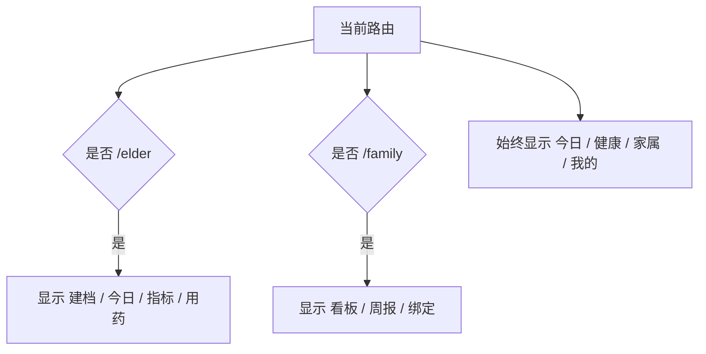
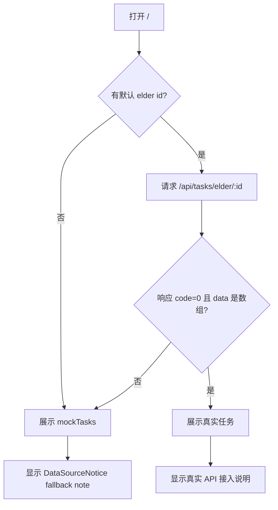
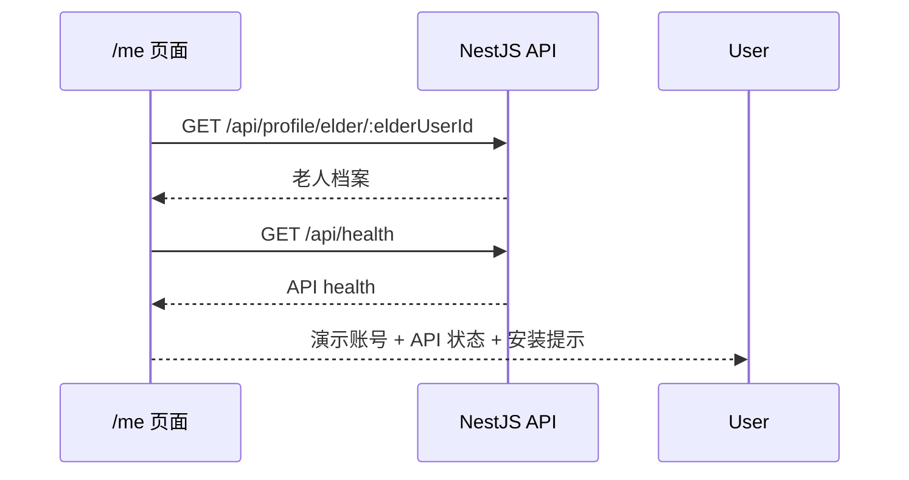
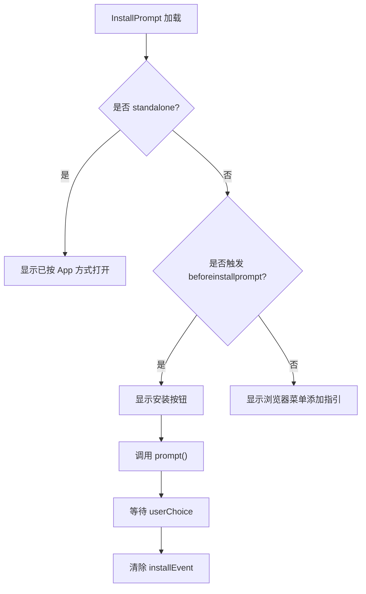
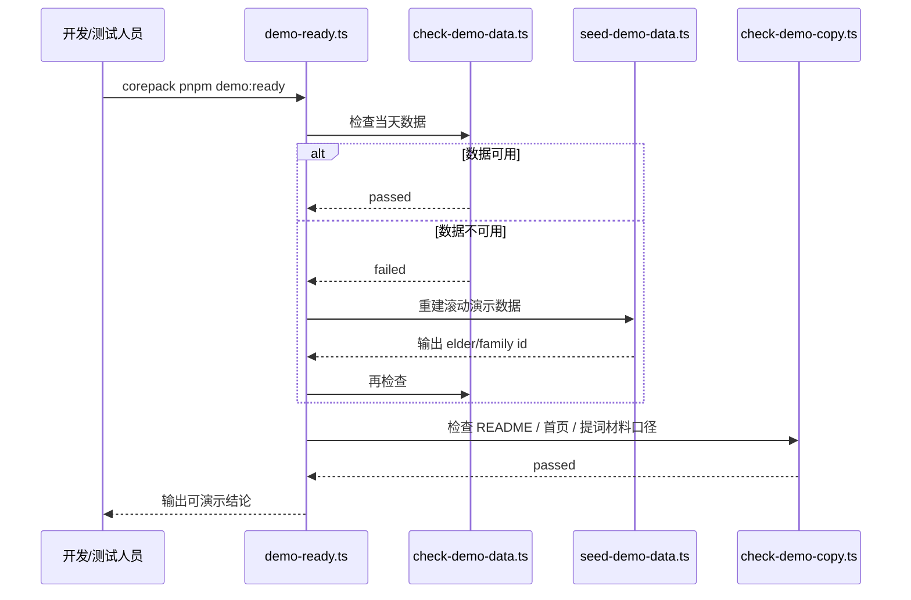

# Silver Health 重点技术方案详解

本文档聚焦 Silver Health H5/PWA 可安装上线版中的关键技术决策。它不是全量方案，而是解释为什么这样设计，以及后续改动时哪些地方最容易踩坑。

## 1. 为什么第一阶段选择 H5/PWA

第一阶段目标是验证“老人日常任务 + 健康记录 + 家属查看 + 周报”的闭环，而不是先投入原生端或小程序。

选择 H5/PWA 的原因：

- 发布成本低：Vercel Web 发布后手机浏览器即可访问；
- 安装成本低：支持添加到主屏幕，能接近 App 使用心智；
- 迭代快：Next.js 页面和 API 可以快速调整；
- 复用现有工程：当前 monorepo 已经是 Next.js + NestJS + Prisma；
- 后续可迁移：API 和业务模型稳定后，再做小程序或原生端更稳。

第一阶段主动不做：

- 小程序；
- 原生 iOS / Android；
- 真实登录；
- 服务端推送；
- 医疗级实时告警。

这样可以把复杂度压在“真实可用的主链路”上，而不是提前消耗在多端适配和账号体系上。

## 2. 底部四 Tab 的设计逻辑

当前主 Tab：

```text
今日 / 健康 / 家属 / 我的
```

设计依据：

- 老人端优先：默认打开就是“今天该做什么”；
- 家属端摘要化：家属不需要进入复杂功能树，先看近况；
- 健康能力聚合：指标录入和用药提醒放在同一个健康中心；
- 我的页承载低频配置：档案、演示账号、API 状态、安装提示。

Tab 与路由关系：

| Tab | 主路由 | 被归入该 Tab 的路由 |
| --- | --- | --- |
| 今日 | `/` | `/` |
| 健康 | `/health` | `/health`、`/elder/metrics`、`/elder/medication` |
| 家属 | `/family/dashboard` | `/family/*` |
| 我的 | `/me` | `/me`、`/elder/profile` |

`app-navigation.tsx` 中的 `isPrimaryActive` 负责把子路由映射到主 Tab。例如：

- `/elder/metrics` 激活 `健康`；
- `/family/report` 激活 `家属`；
- `/elder/profile` 激活 `我的`。

这能避免用户进入深层页面后底部 Tab 激活态丢失。

## 3. 主导航与角色上下文导航并存

当前导航有两层：

- 底部主 Tab：全局信息架构；
- 顶部上下文 Tab：老人页或家属页内部的局部切换。



这样设计的好处：

- 主 Tab 保持稳定，用户知道自己在大模块中的位置；
- 老人端和家属端原有页面不用一次性重写；
- `/demo` 路演入口仍能串起旧主链路；
- 后续可以逐步把上下文 Tab 融入主 Tab，而不破坏现有路由。

需要注意：

- 上下文 Tab 不应越来越多；
- 如果某个页面已经成为主流程，应考虑归入四个主 Tab；
- 底部 Tab 要避免遮挡页面底部按钮，所以页面使用 `app-shell--tabbed` 留出底部空间。

## 4. 今日工作台的 fallback 机制

`/` 是上线版默认首页，因此它不能因为 API 暂时不可用就空白。

当前策略：



设计重点：

- fallback 不是静默的，必须告诉用户当前使用演示数据；
- fallback 数据要足够完整，能保持首页可用；
- `cache: 'no-store'` 确保任务状态更新后不会被 Next 缓存误导；
- 页面文案避免出现技术错误堆栈，只保留可理解的失败原因。

当前 mockTasks 覆盖：

- 待完成运动任务；
- 待完成测量任务；
- 已完成用药任务。

这保证了首页统计卡、下一项待办、任务列表都有数据可展示。

## 5. 健康中心聚合策略

`/health` 同时读取指标和用药提醒：

```ts
const [metrics, reminders] = await Promise.all([
  safeFetchArray<MetricRecord>(`${apiBaseUrl}/api/metrics/elder/${defaultElderUserId}`),
  safeFetchArray<MedicationReminder>(`${apiBaseUrl}/api/medications/elder/${defaultElderUserId}`),
]);
```

为什么使用整体 fallback：

- 健康中心是聚合页，如果指标真实、用药失败，很容易让用户误以为没有用药提醒；
- 第一阶段核心目标是体验完整，不是精细化展示部分失败；
- 整体 fallback 能保持页面稳定和解释一致。

后续可优化：

- 指标和用药各自 fallback；
- 每个区块显示独立错误状态；
- 增加上次成功同步时间；
- 离线时显示最近一次缓存数据。

## 6. 我的页的双重职责

`/me` 当前承担两个职责：

1. 用户身份说明：当前演示老人是谁；
2. 环境状态说明：API 是否可用、数据源是什么、PWA 是否可安装。

它并不是传统 App 的完整个人中心，而是第一阶段上线验收的控制台。



关键价值：

- 测试人员能快速知道当前是不是连上真实 API；
- 家属或老人能看到当前账号；
- 安装提示有固定位置，不只依赖浏览器自动弹窗。

## 7. PWA 注册为什么只在生产环境启用

`PwaRegister` 中有条件：

```ts
if (!('serviceWorker' in navigator) || process.env.NODE_ENV !== 'production') {
  return;
}
```

原因：

- Next dev 热更新容易被 service worker 缓存干扰；
- 开发环境下缓存旧页面会导致调试误判；
- PWA installability 应以 `next build && next start` 或线上环境为准；
- 生产环境才需要离线 fallback。

测试 PWA 时不要只跑 `next dev`，应使用：

```bash
cd apps/web
corepack pnpm build
corepack pnpm start
```

## 8. Service Worker 缓存策略

当前 `sw.js` 是保守方案：

- 预缓存最小 shell；
- 导航请求网络优先；
- 网络失败时给离线页；
- 静态资源缓存优先；
- 不缓存 API 数据。

```mermaid
flowchart TD
  Request["请求进入 service worker"] --> Nav{"mode === navigate"}
  Nav -->|是| NetworkFirst["网络优先"]
  NetworkFirst -->|成功| Page["返回页面"]
  NetworkFirst -->|失败| Offline["返回 offline.html"]
  Nav -->|否| CacheMatch["查缓存"]
  CacheMatch -->|命中| Asset["返回缓存资源"]
  CacheMatch -->|未命中| FetchAsset["请求网络资源"]
```



为什么不缓存 API：

- 健康数据涉及时效性；
- 当前还没有上次同步时间和数据版本；
- 静默缓存 API 容易让用户误以为数据是最新；
- 第一阶段离线目标是“有明确提示”，不是“离线也完整可用”。

后续如果要离线可读，应同时增加：

- API 响应缓存；
- 上次同步时间；
- 离线状态条；
- 恢复网络后的刷新策略。

## 9. 安装提示的浏览器差异

`beforeinstallprompt` 并不是所有浏览器都会触发：

- Android Chrome 常见支持；
- iOS Safari 不提供同样事件；
- 桌面浏览器和部分内嵌浏览器行为不一致。

当前 `InstallPrompt` 的策略：

- 如果支持事件，显示 `安装到手机` 按钮；
- 如果不支持事件，显示手动指引；
- 如果已经 standalone 打开，显示已按 App 方式打开。



## 10. API CORS 的部署细节

Railway API 需要允许 Vercel Web 域名访问。

当前代码：

```ts
const allowedOrigins = (process.env.CORS_ORIGIN ?? '')
  .split(',')
  .map((origin) => origin.trim())
  .filter(Boolean);

app.enableCors({
  origin: allowedOrigins.length > 0 ? allowedOrigins : true,
  credentials: true,
});
```

注意事项：

- 如果 `CORS_ORIGIN` 为空，当前允许所有 origin，便于本地开发；
- 生产环境必须配置明确域名；
- 多域名用英文逗号分隔；
- 如果未来启用 cookie/session，`credentials: true` 与具体 origin 配置更重要；
- 不要把生产环境长期留在全开放 CORS。

## 11. demo:ready 的技术价值

`demo:ready` 不只是 seed 脚本，它是第一阶段上线前的“数据与口径闸门”。

流程：



它检查：

- 今日任务是否存在；
- 最新指标是否对齐；
- 用药提醒是否启用；
- 家属绑定是否有效；
- 最近完整周周报是否正确；
- README、首页、cheatsheet、script、demo 入口文案是否一致。

后续建议：

- 把远程 seed 模式也纳入文档；
- 支持传入 `DATABASE_URL` 明确目标环境；
- 输出 JSON 格式，方便 CI 读取。

## 12. 本地开发与生产启动的差异

开发模式：

```bash
corepack pnpm --filter @silver-health/web dev
```

生产模式：

```bash
cd apps/web
corepack pnpm build
corepack pnpm start
```

差异：

| 项目 | dev | production |
| --- | --- | --- |
| Next 编译 | 按需编译 | 预构建 |
| Service worker | 不注册 | 注册 |
| PWA installability | 不完整 | 可验证 |
| chunk 缓存 | 易受 `.next` 状态影响 | 更接近 Vercel |
| 推荐用途 | 开发调试 | 上线前验收 |

如果遇到 `Cannot find module './xxx.js'`，优先清 `.next` 并重新构建。

## 13. 远程数据库 seed 的关键注意事项

第一阶段 Web 没有登录，因此 `NEXT_PUBLIC_DEFAULT_ELDER_USER_ID` 是核心配置。

正确顺序：

1. 连接远程 `DATABASE_URL`；
2. 执行 `corepack pnpm prisma:migrate:deploy`；
3. 执行 seed；
4. 从 seed 输出复制 elder user id；
5. 配置到 Vercel；
6. 重新部署 Web。

错误顺序示例：

- 先部署 Web，再用本地 elder id 配远程环境；
- 远程 seed 后忘记更新 Vercel 环境变量；
- Railway API 指向远程库，但 Web elder id 仍是本地库 ID。

这些都会导致 Web 请求真实 API 但拿不到数据，然后回退 mock。

## 14. 移动端设计底线

来自 `silver-mobile-design` 的当前底线：

- 360px 到 430px 宽度无横向滚动；
- 主按钮高度至少 44px，优先 48px；
- 老人侧一屏一个主要动作；
- 家属侧摘要优先；
- 表单单列；
- 错误信息在字段下方；
- 状态不能只靠颜色表达；
- 卡片不嵌套卡片；
- 首页不是营销落地页，而是可用工作台。

本轮实现对应：

- `/` 是今日工作台；
- `/health` 是健康聚合；
- `/family/dashboard` 是家属摘要；
- `/me` 是账号与安装状态；
- `/demo` 只服务路演和交接。

## 15. 后续重构建议

### 15.1 抽象移动端页面壳

当前页面重复使用：

- `app-shell app-shell--tabbed`
- `PageHeader`
- `DataSourceNotice`
- `StatCard`
- `quick-action-grid`

建议后续沉淀：

```text
MobilePageShell
MobileDashboard
StatusSummary
PrimaryActionGrid
InstallStatusPanel
```

### 15.2 把 fallback 状态标准化

当前每个页面自己维护 mock 和 note。后续可统一为：

```ts
type DataResult<T> =
  | { source: 'api'; data: T }
  | { source: 'mock'; data: T; note: string }
  | { source: 'empty'; data: T; note: string };
```

价值：

- 页面状态更一致；
- 测试更容易；
- 线上问题更容易定位。

### 15.3 增加移动端 E2E

建议测试：

- 打开 `/`；
- 检查 `scrollWidth <= innerWidth`；
- 检查四 Tab；
- 检查主按钮高度；
- 检查表单控件高度；
- 截图保存。

这能避免后续样式迭代破坏移动端底线。

## 16. 关键风险

| 风险 | 说明 | 当前缓解 | 后续建议 |
| --- | --- | --- | --- |
| 固定演示账号 | 无登录导致不能真实隔离用户 | 第一阶段明确为 demo 账号 | P2 做真实账号体系 |
| mock fallback 掩盖线上错误 | API 失败时页面仍可用 | DataSourceNotice 明确提示 | 增加错误上报 |
| PWA 图标规格不足 | SVG 可能不满足所有平台 | 当前能提供基础 manifest | 补 PNG 192/512 |
| 离线能力较弱 | 当前只返回离线页 | 明确离线提示 | 增加只读缓存 |
| 远程 ID 配置错误 | Web/API/DB 不匹配会回退 mock | 文档要求记录 seed ID | 增加环境自检脚本 |

## 17. 结论

当前技术方案的核心是：用 H5/PWA 先把老人和家属的真实试用闭环跑起来，用四 Tab 统一手机端信息架构，用固定演示账号降低第一阶段复杂度，用 `demo:ready` 保证数据和文案不漂移，再用 Vercel + Railway 快速上线验证。

后续真正重要的不是继续堆页面，而是：

- 远程部署闭环；
- PWA installability 细节；
- 任务和指标的真实写入同步；
- 表单 ID 暴露收敛；
- 账号体系和通知能力的分阶段引入。
