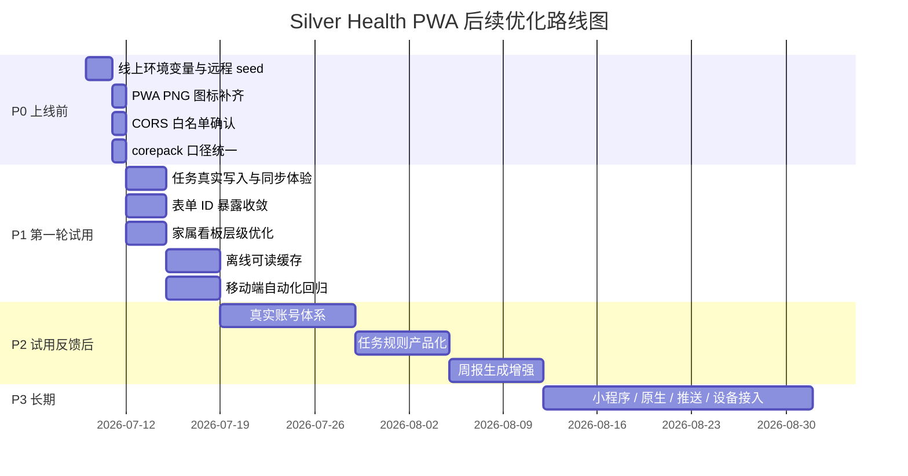

# Silver Health H5/PWA 待优化项

本文档按优先级记录 Silver Health 从第一阶段 H5/PWA 可试用版本继续走向“可安装、可上线、可长期维护”的优化项。优先级定义如下：

- P0：上线前必须处理，否则影响可访问、可演示或数据安全；
- P1：上线后第一轮真实试用前应处理，影响核心体验和稳定性；
- P2：试用反馈后推进，提升产品完整度和运营效率；
- P3：中长期能力，适合在 PWA 跑通后进入小程序、原生 App 或商业化阶段。

## P0 上线前必须处理

### P0-1 线上环境变量与远程 seed 闭环

现状：

- 本地已经通过 `demo:ready`；
- 第一阶段线上需要 Vercel Web + Railway API/PostgreSQL；
- 默认老人 ID 必须来自远程 seed，而不是本地 seed。

待做：

- Railway 创建 PostgreSQL；
- API 配置 `DATABASE_URL`、`PORT`、`CORS_ORIGIN`；
- 远程环境执行 migration 和 seed；
- 记录远程 seed 输出的 elder user id；
- Vercel 配置 `NEXT_PUBLIC_API_BASE_URL` 与 `NEXT_PUBLIC_DEFAULT_ELDER_USER_ID`；
- 线上执行 `/me` 检查 API 状态是否为正常。

验收：

```bash
curl https://your-railway-api-domain/api/health
```

手机打开 Vercel 首页后：

- `/` 能看到今日任务；
- `/health` 能看到指标和用药；
- `/family/dashboard` 能看到家属摘要；
- `/me` API 状态为正常。

### P0-2 PWA 图标补齐 PNG 规格

状态：

- 已补齐 `icon-192.png` 和 `icon-512.png`；
- `manifest.webmanifest` 已同时声明 PNG 和 SVG；
- `sw.js` 已把 PNG 图标加入预缓存。

后续验收：

- 用 Chrome Lighthouse / Application 面板确认 installability。

验收：

- 手机浏览器可添加到主屏幕；
- 主屏幕图标清晰；
- Android Chrome 不报 manifest icon 警告。

### P0-3 生产域名 CORS 白名单确认

现状：

- API 已支持 `CORS_ORIGIN` 逗号分隔；
- 线上必须把 Vercel 域名或自定义域名加入 CORS。

待做：

- 明确正式 Web 域名；
- Railway 配置 `CORS_ORIGIN`；
- 如果有预览域和正式域，使用逗号分隔；
- 验证浏览器请求不被 CORS 拦截。

验收：

```bash
curl -I \
  -H "Origin: https://your-vercel-domain.vercel.app" \
  https://your-railway-api-domain/api/health
```

### P0-4 根启动命令与 corepack 口径统一

状态：

- 当前稳定验证使用 `corepack pnpm ...`；
- 已新增 `apps/web/vercel.json` 和 `railway.json`，部署命令显式使用 `corepack pnpm`；
- 已新增 `prisma:migrate:deploy`，远程库初始化使用生产迁移命令。

待做：

- README、上线文档统一强调 `corepack pnpm`；
- 必要时增加 `.npmrc` 或进一步文档说明，避免 pnpm 版本漂移。

验收：

- 新机器按 README 操作可复现；
- 不出现 Prisma Client 缺失；
- 不出现 pnpm 版本导致的 ignored builds 阻塞。

## P1 上线后第一轮真实试用前处理

### P1-1 完成任务的真实写入与状态同步体验

现状：

- 今日工作台已展示任务；
- 任务列表已有交互基础；
- 需要在线上验证完成任务写入、刷新和家属端同步。

待做：

- 确认任务完成 API 是否具备幂等处理；
- 任务完成后刷新今日进度；
- 家属看板同步展示当天变化；
- 弱网或失败时给出明确错误提示。

验收：

- 老人完成一项任务；
- 回到今日页看到已完成数量增加；
- 家属看板看到任务摘要更新。

### P1-2 健康指标录入链路减轻 ID 暴露

现状：

- 第一阶段为了 MVP，部分表单仍需要展示档案编号或录入人编号；
- 对普通老人用户来说，内部 ID 不自然。

待做：

- 默认从环境变量或页面上下文填入 elder id；
- 表单里用“档案编号”解释，不展示技术字段名；
- 能隐藏的 ID 尽量隐藏；
- 保留开发/演示模式下的可见调试信息。

验收：

- 老人录指标不需要理解 `elderUserId`；
- 表单仍能提交成功；
- 错误提示能定位到用户能理解的字段。

### P1-3 家属 Tab 的信息层级再收敛

现状：

- 家属 Tab 现在直接进入 `/family/dashboard`；
- 家属看板、周报、绑定仍有角色上下文 Tab。

待做：

- 家属首页增加更清晰的一句话近况；
- 今日关注、异常提醒、周报入口按优先级排序；
- 绑定状态只在需要时出现，不干扰常用看板。

验收：

- 家属进入后 5 秒内知道“今天是否正常”；
- 周报入口明显；
- 绑定入口存在但不喧宾夺主。

### P1-4 PWA 离线体验从 fallback 升级为可读缓存

现状：

- 当前断网导航失败时返回 `offline.html`；
- 用户离线时无法阅读最近一次健康摘要。

待做：

- 缓存最近访问过的 shell 页面；
- 缓存最近一次首页和健康摘要的只读数据；
- 离线时显示“上次同步时间”；
- 恢复网络后自动刷新。

验收：

- 断网后可打开最近访问过的 `/`；
- 页面明确显示离线状态；
- 恢复网络后能重新拉取数据。

### P1-5 自动化移动端回归

现状：

- 已新增第一层 Playwright 手机视口 E2E；
- `test:e2e:mobile` 默认检查线上 PWA；
- 已新增本地可重置数据环境下的写入型 E2E；
- 后续 UI 改动可以同时用线上只读 E2E 和本地写入 E2E 双层回归。

已完成：

- 覆盖 390x844 和 360x800；
- 检查四个底部主 Tab 可点击切换；
- 检查激活态 `aria-current="page"`；
- 检查首页线上 demo 数据可见；
- 检查无横向滚动；
- 检查底部 Tab、主操作按钮、操作卡片和按钮高度不低于 44px；
- 失败时输出 Playwright screenshot 和 trace；
- `test:e2e:local-write` 会先执行本地 `demo:reset -- --skip-smoke`，再启动本地 API/Web；
- 覆盖“完成任务 / 录入指标 / 新增用药提醒 / 家属看板同步”；
- 修复了指标表单默认测量时间使用服务端 UTC 的问题，避免刚录入的数据早于 seed 数据。

验收：

```bash
corepack pnpm test:e2e:mobile
corepack pnpm test:e2e:local-write
```

下一步待做：

- 将 `test:e2e:local-write` 评估接入 GitHub Actions 手动工作流；
- 继续补充家属绑定等写入型链路；
- 整理 Node ESM warning，统一 scripts 的模块运行方式。

### P1-6 GitHub Actions 手动上线门禁

现状：

- 已新增 `.github/workflows/release-gates.yml`；
- workflow 使用 `workflow_dispatch` 手动触发；
- 支持输入 Web URL、API URL、默认老人账号；
- 支持开关生产 smoke、移动 E2E、Vercel dry-run；
- 当前只做门禁和 dry-run，不自动生产发布。

已完成：

- 安装依赖并生成 Prisma Client；
- Web typecheck；
- Web production build；
- API production build；
- `test:demo-reset-utils`；
- `test:smoke-utils`；
- `test:vercel-deploy-utils`；
- `test:github-workflow`；
- 可选 `smoke:production`；
- 可选 `test:e2e:mobile`；
- 可选 `deploy:vercel` dry-run。

验收：

```bash
corepack pnpm test:github-workflow
ruby -e "require 'yaml'; YAML.load_file('.github/workflows/release-gates.yml'); puts :ok"
```

下一步待做：

- 在 GitHub Actions 页面实际触发一次 workflow；
- 如需自动发布，再单独增加受保护的 production deploy workflow；
- 为 GitHub Actions 配置 Vercel/Railway secrets 后，再考虑远程 seed/reset 的受控工作流。

## P2 试用反馈后推进

### P2-1 真实账号体系

目标：

- 从固定演示账号升级到真实用户；
- 支持老人、家属不同角色；
- 支持一个家属绑定多个老人。

建议步骤：

1. 增加登录方式选择；
2. 增加 session / token；
3. API 按角色鉴权；
4. 前端隐藏所有默认 ID；
5. 家属绑定流程转为邀请或验证码确认。

风险：

- 权限边界会影响所有 API；
- 数据迁移要避免演示账号与真实账号混杂。

### P2-2 任务生成规则产品化

目标：

- 让任务不是只靠 seed，而是能按老人档案、用药提醒、健康目标自动生成。

建议：

- 基于用药提醒生成服药任务；
- 基于健康指标目标生成测量任务；
- 支持家属添加临时关注事项；
- 支持任务模板。

### P2-3 周报生成逻辑增强

目标：

- 周报从固定 seed 数据升级为可根据真实任务、指标、用药自动生成。

建议：

- 任务完成率；
- 指标趋势；
- 用药提醒完成情况；
- 家属关心摘要；
- 风险提示但避免过度医疗化。

### P2-4 可观测性与错误追踪

目标：

- 上线后知道 API 和页面哪里出了问题。

建议：

- API 日志结构化；
- Web 错误上报；
- Railway health 监控；
- Vercel 构建和运行错误告警；
- demo:ready 失败时输出更清晰的修复建议。

### P2-5 UI 组件沉淀

现状：

- 当前 Web 使用 `page-kit.tsx` 和 `globals.css` 复用一部分组件；
- 页面层仍有局部样式和重复结构。

建议：

- 沉淀 `MobilePageShell`；
- 沉淀 `DashboardStatGrid`；
- 沉淀 `DataPanel`；
- 沉淀 `PrimaryActionList`；
- 统一空状态、错误状态、加载状态。

## P3 中长期能力

### P3-1 微信小程序

适合时机：

- H5/PWA 已验证核心闭环；
- 老人和家属真实试用反馈明确；
- 需要微信生态分发、订阅消息或家庭群分享。

前置条件：

- API 鉴权稳定；
- 账号体系稳定；
- UI 信息架构稳定；
- 任务/指标/周报核心模型稳定。

### P3-2 原生 App

适合时机：

- 需要更强通知能力、后台任务、设备集成；
- PWA 安装率或留存不足；
- 有明确 iOS / Android 预算。

前置条件：

- 产品闭环已验证；
- API 合同稳定；
- 设计系统稳定；
- 隐私合规路径清楚。

### P3-3 服务端推送与提醒

目标：

- 用药提醒、健康测量、家属关注真正触达用户。

候选路线：

- Web Push；
- 微信订阅消息；
- 短信；
- App Push。

风险：

- 推送频率需要克制；
- 医疗健康类提醒需要清晰免责声明；
- 用户授权和退订机制必须完整。

### P3-4 健康设备接入

目标：

- 接入血压计、血糖仪、手环或第三方健康平台。

建议：

- 先支持手动录入；
- 再支持 CSV / 图片辅助录入；
- 最后接第三方设备 API。

### P3-5 多租户与运营后台

目标：

- 支持养老机构、社区、医生或健康管理师使用。

建议：

- 增加机构模型；
- 增加工作人员角色；
- 增加运营后台；
- 增加批量导入；
- 增加权限审计。

## 优先级路线图



## 建议下一步

建议先完成 P0：

1. 配置 Railway PostgreSQL 和 API；
2. 执行远程 migration + seed；
3. 配置 Vercel Web 环境变量；
4. 补齐 PNG PWA 图标；
5. 用真实手机完成一次添加到主屏幕验收。

P0 通过后，再进入 P1 的任务完成同步、表单减负、家属看板体验优化。
