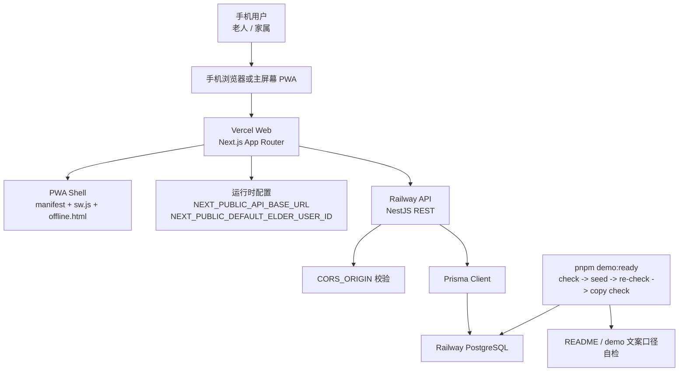
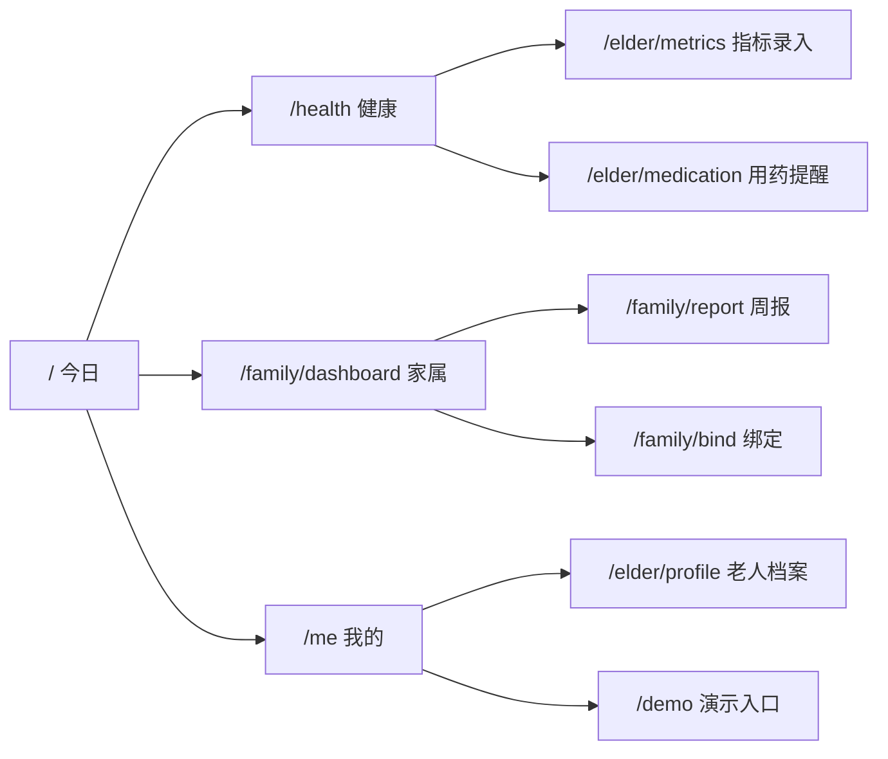
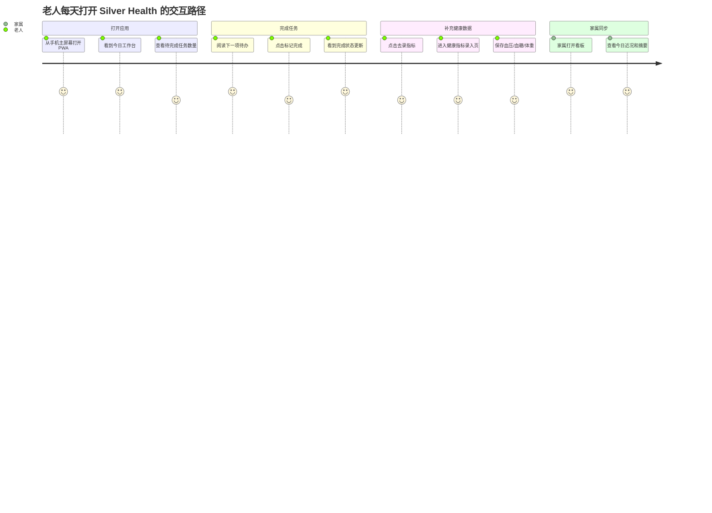
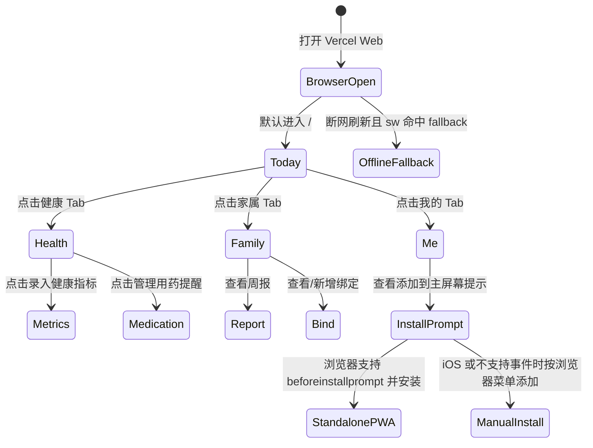
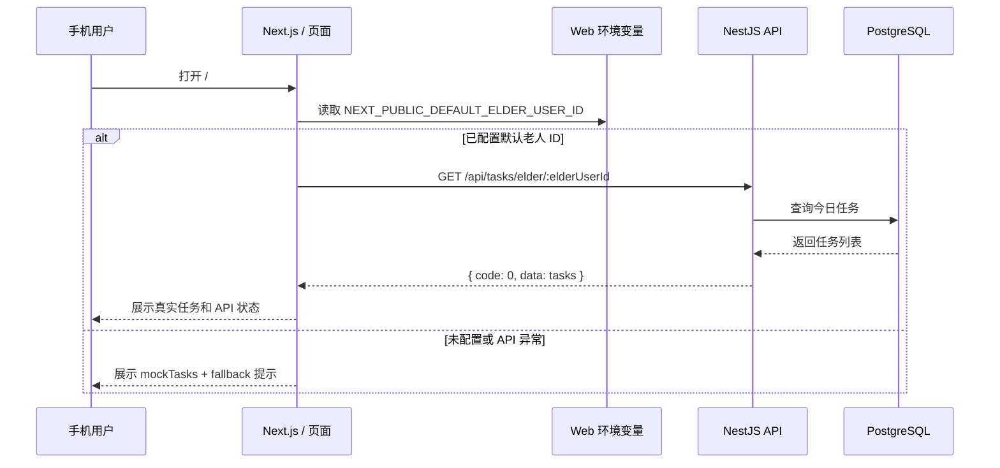
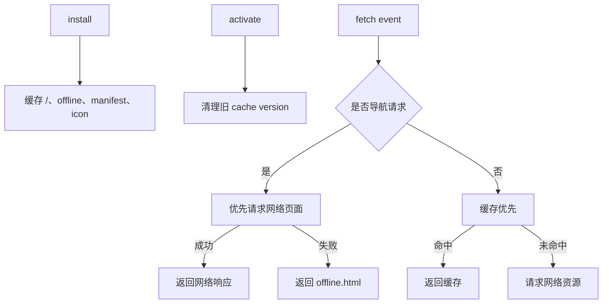
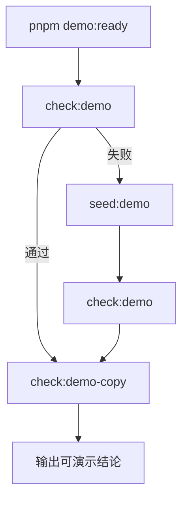
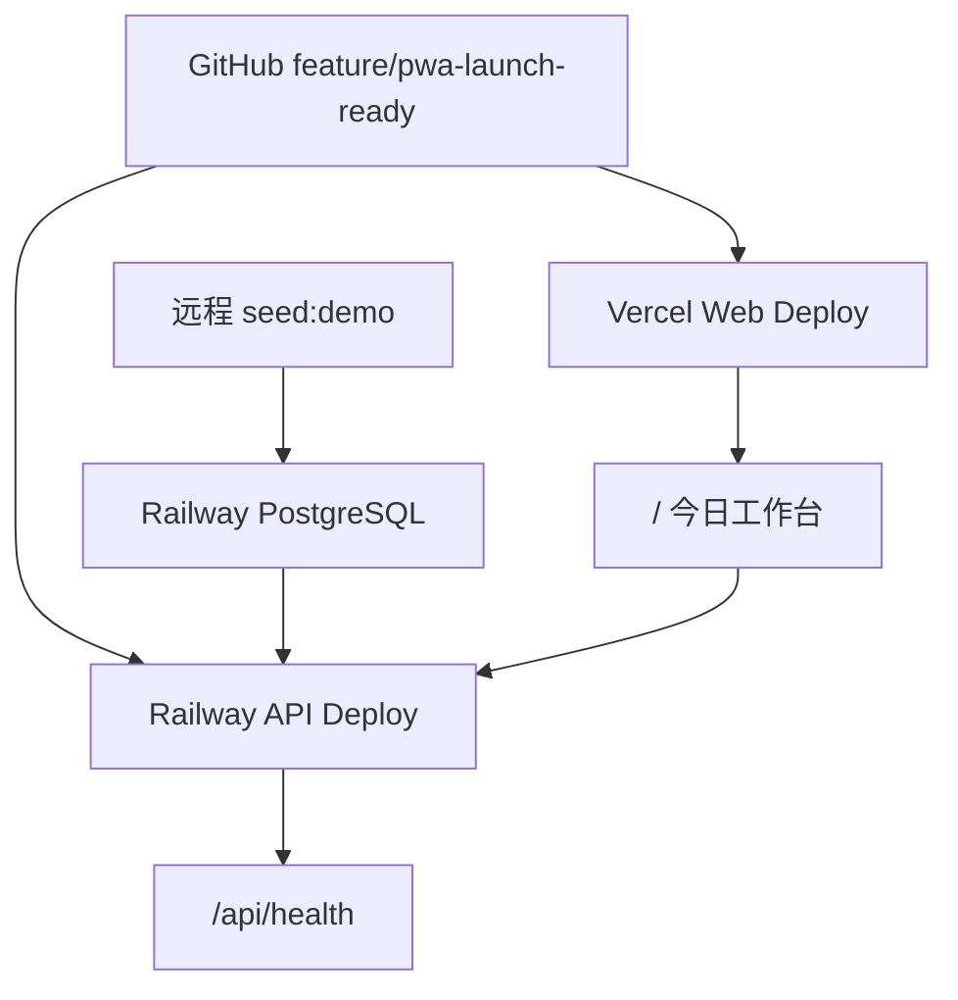

# Silver Health H5/PWA 技术方案实现

本文档说明 Silver Health 第一阶段可安装上线版的技术实现方案。目标是把当前 MVP 从“本地演示页面”推进到“手机浏览器可访问、可添加到主屏幕、可连接远程 API、可用固定演示账号真实试用”的 H5/PWA 形态。

## 1. 建设目标

第一阶段目标不是一次性做完整原生 App，而是先完成一个稳定的 H5/PWA：

- 手机端优先，默认入口是老人每天会打开的 `今日` 工作台；
- 底部主导航统一为 `今日 / 健康 / 家属 / 我的`；
- 保留已有老人端、家属端业务页面，并纳入更清晰的信息架构；
- 支持 PWA 安装壳、应用图标、manifest、service worker、离线提示页；
- Web 部署目标为 Vercel，API 与 PostgreSQL 部署目标为 Railway；
- 第一阶段继续使用固定演示老人 / 家属账号，不做真实登录；
- 保留 `pnpm demo:ready` 作为上线前数据准备和口径自检命令。

## 2. 技术栈与代码边界

| 层级 | 技术 | 说明 |
| --- | --- | --- |
| Web | Next.js App Router | `apps/web/app` 承载 H5/PWA 页面 |
| API | NestJS | `apps/api/src` 承载 REST API |
| ORM | Prisma | `prisma/schema.prisma` 管理数据模型 |
| Database | PostgreSQL | 本地和 Railway 远程库使用同一套 schema |
| Monorepo | pnpm workspace | 根目录统一脚本，子应用按 filter 构建 |
| PWA | Web Manifest + Service Worker | 当前实现基础安装壳、静态缓存、离线 fallback |

主要目录：

```text
apps/web/app/
  page.tsx                  # 今日工作台，正式默认首页
  health/page.tsx           # 健康 Tab 聚合页
  family/dashboard/page.tsx # 家属 Tab 默认页
  me/page.tsx               # 我的 Tab
  demo/page.tsx             # 演示入口，替代旧首页演示清单
  ui/app-navigation.tsx     # 底部主 Tab + 角色上下文 Tab
  ui/install-prompt.tsx     # PWA 安装提示
  ui/pwa-register.tsx       # service worker 注册

apps/web/public/
  manifest.webmanifest
  sw.js
  offline.html
  icons/icon.svg
  icons/icon-192.png
  icons/icon-512.png

apps/api/src/main.ts        # API 启动、CORS、PORT、全局校验
scripts/
  demo-ready.ts
  check-demo-data.ts
  seed-demo-data.ts
  check-demo-copy.ts
```

## 3. 总体架构



关键点：

- Web 与 API 分开部署，Web 通过 `NEXT_PUBLIC_API_BASE_URL` 指向 API；
- 第一阶段不做登录，Web 使用 `NEXT_PUBLIC_DEFAULT_ELDER_USER_ID` 读取默认演示老人；
- API 通过 `CORS_ORIGIN` 限制线上 Web 域名；
- `demo:ready` 负责把当天演示数据和文档口径拉齐；
- PWA 只负责安装壳与基础离线体验，不承担服务端推送。

## 4. 信息架构

本轮重构把入口从“开发演示清单”切换为“真实用户打开后的工作台”。



四个底部 Tab 的职责：

| Tab | 路由 | 用户心智 | 主要内容 |
| --- | --- | --- | --- |
| 今日 | `/` | 今天先做什么 | 今日任务、完成进度、下一项待办、录指标快捷入口 |
| 健康 | `/health` | 健康记录在哪里 | 最近指标、指标录入入口、用药提醒入口 |
| 家属 | `/family/dashboard` | 家属看什么 | 一句话近况、任务/指标/用药摘要、周报入口 |
| 我的 | `/me` | 当前账号和安装状态 | 演示账号、API 状态、档案入口、安装提示 |

旧演示入口不删除，而是迁移到 `/demo`。这样可以同时满足两个场景：

- 正式试用：从 `/` 进入；
- 路演讲解：从 `/demo` 看固定讲解顺序。

## 5. 用户交互图

### 5.1 老人日常使用路径



### 5.2 H5/PWA 页面交互状态



## 6. 数据流

### 6.1 今日工作台数据流



设计原则：

- 页面首屏不能因为 API 不可用而空白；
- 所有关键页保留 mock fallback，保证演示连续性；
- fallback 必须明确告诉用户当前是演示数据或 API 不可用；
- API 成功时显示真实 API 状态。

### 6.2 健康中心数据流

`/health` 聚合两类数据：

- `GET /api/metrics/elder/:elderUserId`
- `GET /api/medications/elder/:elderUserId`

页面通过 `Promise.all` 并行获取指标和用药提醒。任一请求失败时，当前策略是整体回退到演示健康数据，避免出现“指标是真实、用药为空但没有解释”的混合状态。

### 6.3 我的页面数据流

`/me` 聚合：

- `GET /api/profile/elder/:elderUserId`
- `GET /api/health`

用于回答两个问题：

- 当前演示账号是谁；
- 当前 API 是否可访问。

## 7. PWA 实现

### 7.1 Manifest

`apps/web/public/manifest.webmanifest` 定义：

- 应用名与短名；
- `start_url: "/"`；
- `display: "standalone"`；
- 主题色与背景色；
- PNG 192/512 图标与 SVG 备用图标。

### 7.2 Service Worker

`apps/web/public/sw.js` 当前做基础能力：

- install 阶段预缓存 `/`、`/offline.html`、manifest、图标；
- activate 阶段清理旧版本缓存；
- fetch 阶段：
  - 导航请求失败时返回 `/offline.html`；
  - 其他静态请求优先读缓存，失败时返回空响应。



### 7.3 注册策略

`PwaRegister` 只在生产环境注册 service worker：

- 避免开发环境缓存干扰调试；
- 避免 Next dev 热更新被 service worker 缓存污染；
- Vercel 或本地 `next build && next start` 更接近真实 PWA 运行形态。

### 7.4 安装提示

`InstallPrompt` 监听：

- `beforeinstallprompt`：Chrome/Edge 等支持时拦截安装事件并显示按钮；
- `appinstalled`：安装完成后切换状态；
- `display-mode: standalone` 或 iOS `navigator.standalone`：识别已按 App 方式打开。

当浏览器不触发 `beforeinstallprompt` 时，页面展示手动提示：“用浏览器菜单添加到主屏幕”。

## 8. API 上线配置

`apps/api/src/main.ts` 增加生产可配置 CORS：

```ts
const allowedOrigins = (process.env.CORS_ORIGIN ?? '')
  .split(',')
  .map((origin) => origin.trim())
  .filter(Boolean);

app.enableCors({
  origin: allowedOrigins.length > 0 ? allowedOrigins : true,
  credentials: true,
});
```

端口读取：

```ts
const port = process.env.PORT ? Number(process.env.PORT) : 3001;
await app.listen(port);
```

上线环境变量：

```env
DATABASE_URL="postgresql://..."
PORT="3001"
CORS_ORIGIN="https://your-vercel-domain.vercel.app"
JWT_SECRET="replace-with-production-secret"
```

## 9. 演示数据策略

第一阶段不做真实多用户登录，使用固定演示账号。核心命令：

```bash
corepack pnpm demo:ready
```

内部流程：



`demo:ready` 解决两个问题：

- 数据滚动：今日任务、最新指标、最近完整周周报不会因日期变化而失效；
- 口径一致：README、首页、cheatsheet、script、demo 页面关键结论不漂移。

## 10. 异常与降级策略

| 异常 | 当前策略 | 用户可见反馈 |
| --- | --- | --- |
| 未配置默认老人 ID | 使用 mock 数据 | 提示配置 `NEXT_PUBLIC_DEFAULT_ELDER_USER_ID` |
| API 请求失败 | 使用 mock 数据 | 显示 fallback note，例如 `fetch failed` |
| 健康数据部分失败 | 健康页整体回退 mock | 显示演示健康数据说明 |
| API health 不可用 | 我的页显示 API 不可用 | 不阻塞页面 |
| service worker 注册失败 | 静默失败 | 不阻塞 App 使用 |
| 断网访问页面 | 返回离线页 | 明确说明当前离线 |

## 11. 部署方案



上线顺序建议：

1. Railway 创建 PostgreSQL；
2. Railway 部署 API，配置 `DATABASE_URL`、`PORT`、`CORS_ORIGIN`；
3. 对远程数据库执行 `corepack pnpm prisma:migrate:deploy` 与 seed；
4. 记录 seed 输出的默认 elder id；
5. Vercel 部署 Web，配置 `NEXT_PUBLIC_API_BASE_URL` 与 `NEXT_PUBLIC_DEFAULT_ELDER_USER_ID`；
6. 手机访问 Vercel 首页并添加到主屏幕；
7. 按测试方案完成验收。

## 12. 当前边界

第一阶段明确不做：

- 微信小程序；
- 原生 iOS / Android；
- 真实注册、登录、权限体系；
- 服务端推送；
- 多老人、多家庭真实账号管理；
- 医疗级告警闭环。

这些能力应在 PWA 试用链路稳定、真实用户反馈明确后再进入下一阶段。
