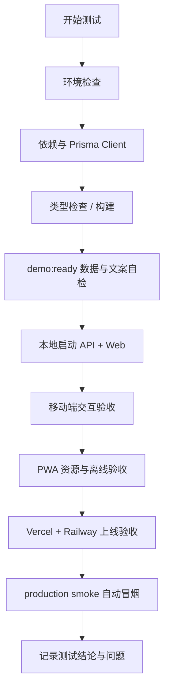

# Silver Health H5/PWA 测试验证方案

本文档用于验证 Silver Health 第一阶段 H5/PWA 可安装上线版。测试目标是证明：本地可运行、构建可通过、数据可准备、手机端体验可用、PWA 资源可访问、线上部署后 Web/API/数据库链路可闭环。

## 1. 测试范围

### 1.1 包含范围

- Web 类型检查与生产构建；
- API 生产构建；
- Prisma Client 生成；
- demo 数据准备与文案口径检查；
- 移动端 390x844 与 360x800 视口验收；
- 四个底部主 Tab 切换；
- 关键表单移动端单列与控件高度；
- PWA manifest、service worker、offline 页面；
- API health；
- 远程 Vercel + Railway 部署后冒烟测试。
- 生产 Web/API/PWA/CORS 自动冒烟脚本。
- Vercel monorepo prebuilt 部署脚本。
- Playwright 手机视口 E2E，覆盖线上 PWA 首页、底部 Tab、横向滚动和触控目标。

### 1.2 不包含范围

- 微信小程序验收；
- 原生 App 上架验收；
- 真实登录 / 注册 / 权限验收；
- 服务端推送；
- 医疗告警合规认证；
- 自动化 E2E 全覆盖。当前 E2E 先覆盖只读导航、布局和线上数据可见性，尚未覆盖会写数据的完成任务、录入指标和家属联动。

## 2. 测试环境

### 2.1 本地环境要求

- Node.js 24+
- corepack
- pnpm 10.0.0
- PostgreSQL
- Git
- 手机浏览器或浏览器移动视口

建议先固定 pnpm 版本：

```bash
corepack enable
corepack prepare pnpm@10.0.0 --activate
corepack pnpm --version
```

期望输出：

```text
10.0.0
```

### 2.2 环境变量

根目录 `.env`：

```env
DATABASE_URL="postgresql://liuzhongliang@localhost:5432/silver_health"
```

`apps/web/.env.local`：

```env
NEXT_PUBLIC_API_BASE_URL=http://localhost:3001
NEXT_PUBLIC_DEFAULT_ELDER_USER_ID=<seed 输出的 elder user id>
```

API 线上环境变量：

```env
DATABASE_URL="postgresql://..."
PORT="3001"
CORS_ORIGIN="https://your-vercel-domain.vercel.app"
JWT_SECRET="replace-with-production-secret"
```

Web 线上环境变量：

```env
NEXT_PUBLIC_API_BASE_URL="https://your-railway-api-domain"
NEXT_PUBLIC_DEFAULT_ELDER_USER_ID="remote-seed-elder-id"
```

## 3. 测试总流程



## 4. 本地基础校验

### 4.1 安装依赖

```bash
corepack pnpm install
```

验收标准：

- 命令退出码为 0；
- 没有依赖解析失败；
- 如果出现 Prisma Client 缺失，执行下一步生成。

### 4.2 生成 Prisma Client

```bash
corepack pnpm prisma:generate
```

验收标准：

- 输出 `Generated Prisma Client`；
- 不再出现 `Cannot find module '.prisma/client/default'`。

### 4.3 Web 类型检查

```bash
corepack pnpm --filter @silver-health/web typecheck
```

验收标准：

- 退出码为 0；
- 无 TypeScript error。

### 4.4 Web 生产构建

```bash
corepack pnpm --filter @silver-health/web build
```

验收标准：

- 输出 `Compiled successfully`；
- 路由列表包含：
  - `/`
  - `/demo`
  - `/health`
  - `/me`
  - `/family/dashboard`
  - `/elder/metrics`
  - `/elder/medication`
  - `/elder/profile`

### 4.5 API 生产构建

```bash
corepack pnpm --filter @silver-health/api build
```

验收标准：

- 退出码为 0；
- `apps/api/dist` 正常生成或更新；
- 无 NestJS 编译错误。

### 4.6 demo 数据准备

```bash
corepack pnpm demo:ready
```

验收标准：

- 如果当天数据为空，脚本能自动执行 seed；
- 最终输出 `Check passed`；
- 输出 demo ready 结论：

```text
现在可以开 API / Web，并优先从今日工作台 / 开始体验；路演讲解再打开 /demo。
```

需要检查的数据点：

- elder 存在；
- family 存在；
- 今日任务数量大于 0；
- 最新指标日期为当天或演示可接受的滚动日期；
- enabled reminders 大于 0；
- active bindings 大于 0；
- latest weekly report 对齐最近完整周。

### 4.7 生产冒烟工具单元测试

```bash
corepack pnpm test:smoke-utils
```

验收标准：

- `production smoke utils` 测试套件通过；
- URL 规范化、路径拼接、页面文本缺失检查、API list payload 汇总逻辑均有覆盖。

### 4.8 演示数据重置工具单元测试

```bash
corepack pnpm test:demo-reset-utils
```

验收标准：

- 未提供确认令牌时不能重置；
- `DATABASE_URL` 输出时会隐藏密码；
- 可解析根目录 `.env` 中的 `DATABASE_URL`；
- 默认重置计划包含 `seed:demo`、`check:demo`、`smoke:production`；
- `--skip-smoke` 时只执行 `seed:demo` 和 `check:demo`。

### 4.9 Vercel 部署工具单元测试

```bash
corepack pnpm test:vercel-deploy-utils
```

验收标准：

- 能规范化 Web/API URL；
- 能生成 Vercel build 所需的 `NEXT_PUBLIC_*` 环境变量；
- 能输出固定的 prebuilt 部署步骤，包含从 `apps/web/.vercel/output` 同步到根 `.vercel/output`。

## 5. 本地运行验证

### 5.1 启动 API

终端 1：

```bash
corepack pnpm --filter @silver-health/api dev
```

或：

```bash
corepack pnpm dev:api
```

访问 health：

```bash
curl http://localhost:3001/api/health
```

验收标准：

- HTTP 200；
- 返回结构中 `code` 为 0。

### 5.2 启动 Web

终端 2：

```bash
corepack pnpm --filter @silver-health/web dev
```

打开：

```text
http://localhost:3000/
```

注意：如果当前环境的根脚本 `pnpm dev:web` 被其他 pnpm 版本劫持，优先使用上面的 `corepack pnpm --filter @silver-health/web dev`。

### 5.3 生产模式本地验证

更接近 Vercel 的方式：

```bash
cd apps/web
corepack pnpm build
corepack pnpm start
```

验收标准：

- `next start` 能启动；
- `http://localhost:3000/` 返回 `今日` 页面；
- 不出现 404；
- 不出现 `.next` 缺失或 chunk 缺失。

## 6. 移动端页面验收

### 6.1 视口要求

至少验证两个视口：

- 390x844；
- 360x800。

### 6.2 通用检查命令

在浏览器控制台执行：

```js
document.documentElement.scrollWidth <= window.innerWidth
```

验收标准：

```text
true
```

### 6.3 首页 `/` 验收

步骤：

1. 打开 `http://localhost:3000/`；
2. 确认 H1 为 `今日`；
3. 确认首屏有今日剩余任务数；
4. 确认有 `去录指标` 主按钮；
5. 确认有 `当前接入` 数据源提示；
6. 确认有今日任务列表；
7. 点击任务的 `标记完成`；
8. 确认任务状态变化或页面刷新后状态保持。

验收标准：

- 页面无横向滚动；
- 主按钮高度不低于 44px；
- 默认入口不再是长篇 demo checklist；
- mock fallback 时有明确说明；
- API 成功时显示真实 API 状态。

### 6.4 底部四 Tab 验收

步骤：

1. 打开 `/`；
2. 点击 `健康`；
3. 点击 `家属`；
4. 点击 `我的`；
5. 点击 `今日` 返回首页。

验收标准：

| 操作 | 预期路由 | 预期标题 |
| --- | --- | --- |
| 点击 今日 | `/` | 今日 |
| 点击 健康 | `/health` | 健康 |
| 点击 家属 | `/family/dashboard` | 家属看板 |
| 点击 我的 | `/me` | 我的 |

每次切换都要确认：

- 激活态正确；
- 页面无横向滚动；
- 底部 Tab 不遮挡主内容；
- 返回浏览器历史可正常工作。

### 6.5 健康页 `/health` 验收

步骤：

1. 打开 `/health`；
2. 确认最近指标卡片；
3. 确认指标记录数量；
4. 确认启用提醒数量；
5. 点击 `录入健康指标`；
6. 返回后点击 `管理用药提醒`。

验收标准：

- 两个入口可点击；
- 指标和提醒摘要不为空，或有明确空状态；
- 进入 `/elder/metrics` 和 `/elder/medication` 后表单可见。

### 6.6 家属页 `/family/dashboard` 验收

步骤：

1. 打开 `/family/dashboard`；
2. 确认一句话近况；
3. 确认任务 / 指标 / 用药摘要；
4. 进入 `/family/report`；
5. 进入 `/family/bind`。

验收标准：

- 家属看板优先展示摘要；
- 周报能看到最近完整周；
- 绑定页移动端表单单列展示。

### 6.7 我的页 `/me` 验收

步骤：

1. 打开 `/me`；
2. 确认当前演示账号；
3. 确认 API 状态；
4. 确认数据源；
5. 确认安装提示；
6. 点击 `编辑老人档案`；
7. 点击 `打开演示入口`。

验收标准：

- API 可用时显示 `正常`；
- API 不可用时显示 `不可用`，但页面不崩溃；
- 安装提示在不支持安装按钮时给出浏览器菜单指引；
- `/demo` 可作为路演入口打开。

## 7. 表单移动端验收

验证路由：

- `/elder/profile`
- `/elder/metrics`
- `/elder/medication`
- `/family/bind`

检查项：

- 表单单列；
- 输入框、选择框、按钮高度不低于 44px；
- 必填字段有 `*` 或明确标记；
- 错误信息出现在字段下方；
- 提交成功后有反馈；
- 360px 视口无横向滚动。

浏览器控制台可执行：

```js
[...document.querySelectorAll('form input, form select, form textarea, form button')]
  .map((el) => Math.round(el.getBoundingClientRect().height))
```

验收标准：

- 所有主要输入控件高度大于等于 44；
- 主提交按钮大于等于 44。

## 8. PWA 验收

### 8.1 静态资源可访问

生产服务启动后执行：

```bash
curl -I http://localhost:3000/manifest.webmanifest
curl -I http://localhost:3000/sw.js
curl -I http://localhost:3000/offline.html
```

验收标准：

- 三个资源都返回 HTTP 200；
- manifest 的 `Content-Type` 为 manifest/json 类；
- `sw.js` 为 JavaScript；
- `offline.html` 为 HTML。

### 8.2 Manifest 内容检查

```bash
curl http://localhost:3000/manifest.webmanifest
```

验收标准：

- `name` 和 `short_name` 存在；
- `start_url` 为 `/`；
- `display` 为 `standalone`；
- `theme_color` 存在；
- 至少有一个 icon。

### 8.3 Service Worker 注册

步骤：

1. 使用生产模式启动 Web；
2. 打开浏览器 DevTools；
3. 进入 Application / Service Workers；
4. 刷新页面。

验收标准：

- service worker 注册成功；
- scope 为当前站点根路径；
- 不影响页面刷新。

注意：开发环境下 `PwaRegister` 不注册 service worker，这是预期行为。

### 8.4 离线 fallback

步骤：

1. 生产模式打开 `/`；
2. 等 service worker 安装完成；
3. DevTools 切换 Offline；
4. 刷新页面或打开未缓存导航页。

验收标准：

- 显示 `offline.html` 离线提示；
- 页面明确告诉用户当前离线；
- 恢复网络后刷新可回到正常页面。

## 9. 线上部署验收

### 9.1 Railway API

检查 health：

```bash
curl https://your-railway-api-domain/api/health
```

验收标准：

- HTTP 200；
- `code` 为 0；
- Railway logs 无启动错误。

检查 CORS：

```bash
curl -I \
  -H "Origin: https://your-vercel-domain.vercel.app" \
  https://your-railway-api-domain/api/health
```

验收标准：

- 响应头包含允许的 origin；
- Web 页面请求不被浏览器 CORS 拦截。

### 9.2 远程数据库 seed

在连接远程库的环境下执行：

```bash
corepack pnpm prisma:generate
corepack pnpm prisma:migrate:deploy
corepack pnpm seed:demo
corepack pnpm check:demo
```

验收标准：

- seed 输出 elder user id；
- `check:demo` 通过；
- 将 elder user id 配到 Vercel。

### 9.3 Vercel Web

打开：

```text
https://your-vercel-domain.vercel.app/
```

验收标准：

- 首页可访问；
- 底部 Tab 可切换；
- `/me` API 状态为 `正常`；
- `/health` 能读到远程 API 数据；
- `/family/dashboard` 能读到家属看板摘要。

### 9.4 手机上线验收

用真实手机执行：

1. 打开 Vercel 首页；
2. 添加到主屏幕；
3. 从主屏幕打开；
4. 检查是否独立窗口显示；
5. 切换四个 Tab；
6. 完成一项任务；
7. 录入一条指标；
8. 查看家属看板；
9. 查看周报。

验收标准：

- 可像 App 一样从桌面打开；
- 四个 Tab 手感稳定；
- 页面文字不重叠；
- 任务、指标、用药、家属看板、周报均有真实或可解释的演示数据。

## 10. 生产自动冒烟

### 10.1 默认线上环境

```bash
corepack pnpm smoke:production
```

默认值：

```text
PRODUCTION_WEB_URL=https://web-nu-blond-89.vercel.app
PRODUCTION_API_BASE_URL=https://silver-health-api-production.up.railway.app
PRODUCTION_ELDER_USER_ID=cmre5b56p0000ij0niccn6i4n
```

验收标准：

- 输出 `Production smoke passed: 17 checks`；
- Web `/`、`/health`、`/family/dashboard`、`/family/report`、`/me` 均返回 200；
- `manifest.webmanifest`、`offline.html`、`sw.js` 均返回 200；
- 首页包含 `今日 / 健康 / 家属 / 我的`；
- 首页包含 `当前接入：真实 API`；
- 首页包含 seed 任务：`晨间散步 20 分钟`、`记录今日血压`；
- API health 返回 `{ code: 0, message: "ok" }`；
- 任务、指标、用药、周报均至少返回 1 条；
- API health 的 CORS `access-control-allow-origin` 等于 Web URL；
- PATCH preflight 返回 204，且允许方法包含 `PATCH`。

### 10.2 覆盖其他环境

```bash
PRODUCTION_WEB_URL="https://your-web-domain" \
PRODUCTION_API_BASE_URL="https://your-api-domain" \
PRODUCTION_ELDER_USER_ID="your-elder-user-id" \
corepack pnpm smoke:production
```

适用场景：

- Vercel 重新绑定自定义域名；
- Railway API 更换域名；
- 远程数据库重新 seed 后默认老人 ID 变化；
- 预发环境需要使用同一套检查脚本。

## 11. Vercel prebuilt 部署

### 11.1 dry-run

```bash
corepack pnpm deploy:vercel
```

验收标准：

- 输出 `mode: dry-run`；
- 只打印 `DRY-RUN` 命令；
- 不创建新的 Vercel deployment。

### 11.2 生产部署

```bash
corepack pnpm deploy:vercel -- --execute
corepack pnpm smoke:production
```

验收标准：

- `vercel build --cwd apps/web --prod --yes` 成功；
- 根目录 `.vercel/output` 被更新；
- `vercel deploy --prod --prebuilt --yes` 成功；
- 输出新的 deployment id；
- 生产别名仍为 `https://web-nu-blond-89.vercel.app`；
- `smoke:production` 通过 17 项检查。

## 12. GitHub Actions 手动门禁

### 12.1 触发方式

进入 GitHub：

```text
Actions -> Silver Health release gates -> Run workflow
```

默认输入：

```text
web_url=https://web-nu-blond-89.vercel.app
api_url=https://silver-health-api-production.up.railway.app
elder_user_id=cmre5b56p0000ij0niccn6i4n
run_production_smoke=true
run_mobile_e2e=true
run_vercel_dry_run=true
```

### 12.2 覆盖命令

workflow 会执行：

```bash
corepack pnpm prisma:generate
corepack pnpm --filter @silver-health/web typecheck
corepack pnpm --filter @silver-health/web build
corepack pnpm --filter @silver-health/api build
corepack pnpm test:demo-reset-utils
corepack pnpm test:smoke-utils
corepack pnpm test:vercel-deploy-utils
corepack pnpm test:github-workflow
corepack pnpm smoke:production
corepack pnpm exec playwright install --with-deps chromium
corepack pnpm test:e2e:mobile
corepack pnpm deploy:vercel
```

### 12.3 验收标准

- workflow 可手动触发；
- Web/API 构建通过；
- 工具测试通过；
- `smoke:production` 通过 17 项检查；
- `test:e2e:mobile` 通过 4 项手机视口 E2E；
- `deploy:vercel` 仅执行 dry-run，不产生生产发布。

### 12.4 本地验证 workflow

```bash
corepack pnpm test:github-workflow
ruby -e "require 'yaml'; YAML.load_file('.github/workflows/release-gates.yml'); puts :ok"
```

说明：本轮尝试用 `corepack pnpm dlx actionlint .github/workflows/release-gates.yml` 校验，但当前 npm 包没有可执行 bin，未作为必跑命令。

## 13. 回归测试清单

每次修改 PWA、导航、首页、API 配置后至少跑：

```bash
corepack pnpm --filter @silver-health/web typecheck
corepack pnpm --filter @silver-health/web build
corepack pnpm --filter @silver-health/api build
corepack pnpm demo:ready
corepack pnpm test:e2e:mobile
corepack pnpm test:e2e:local-write
corepack pnpm test:demo-reset-utils
corepack pnpm test:github-workflow
corepack pnpm test:local-e2e-utils
corepack pnpm test:smoke-utils
corepack pnpm test:vercel-deploy-utils
```

如果改动涉及老人端写入、指标表单、家属看板联动：

```bash
corepack pnpm test:e2e:local-write
```

执行流程：

1. 读取根目录 `.env` 中的 `DATABASE_URL`；
2. 自动执行 `DEMO_RESET_CONFIRM=RESET_DEMO_DATA corepack pnpm demo:reset -- --skip-smoke`；
3. 从 seed 输出中解析 `NEXT_PUBLIC_DEFAULT_ELDER_USER_ID`；
4. 启动本地 API：默认 `http://127.0.0.1:3201`；
5. 启动本地 Web：默认 `http://127.0.0.1:3200`；
6. 执行 Playwright 写入型测试；
7. 测试结束后关闭本地 API/Web。

覆盖范围：

- 老人首页点击“标记完成”；
- API 确认任务 `done` 数量增加；
- 指标录入页保存一条血压指标；
- API 确认指标数量增加；
- 用药提醒页保存一条启用中的提醒；
- API 确认用药提醒数量增加；
- 家属看板显示更新后的任务完成数；
- 家属看板显示刚录入的最新血压；
- 家属看板显示新增用药提醒和更新后的启用提醒数量。

可覆盖端口：

```bash
E2E_LOCAL_API_PORT=4201 E2E_LOCAL_WEB_PORT=4200 corepack pnpm test:e2e:local-write
```

如果改动涉及 Prisma schema 或 seed：

```bash
corepack pnpm prisma:generate
corepack pnpm seed:demo
corepack pnpm check:demo
```

如果改动涉及移动端 UI：

```bash
corepack pnpm test:e2e:mobile
```

当前自动覆盖：

- 390x844；
- 360x800；
- 四个底部主 Tab 切换；
- 首页线上 demo 数据可见；
- 无横向滚动；
- 底部 Tab、主操作按钮、操作卡片和按钮高度不低于 44px；
- 失败时保留 Playwright screenshot 和 trace。

仍需手工补充：

- 表单单列检查；
- 安装到主屏幕后独立窗口检查；
- 离线刷新检查；
- 涉及真实写入的数据联动检查。

如果改动涉及演示数据恢复或线上试用前准备：

```bash
DEMO_RESET_CONFIRM=RESET_DEMO_DATA corepack pnpm demo:reset -- --skip-smoke
corepack pnpm smoke:production
```

验收标准：

- `demo:reset` 输出脱敏数据库目标；
- `seed:demo` 和 `check:demo` 均通过；
- 线上 smoke 仍然通过。

## 14. 常见问题排查

### 14.1 Cannot find module './xxx.js'

通常是 Next `.next` 缓存或 chunk 产物不一致。

处理：

```bash
# 停掉 next dev / next start 后
rm -rf apps/web/.next
corepack pnpm --filter @silver-health/web build
corepack pnpm --filter @silver-health/web dev
```

### 14.2 Cannot find module '.prisma/client/default'

通常是 Prisma Client 未生成或 node_modules 被重建。

处理：

```bash
corepack pnpm prisma:generate
```

### 13.3 pnpm ignored builds

如果环境里有多个 pnpm 版本，优先使用：

```bash
corepack pnpm <command>
```

避免直接调用被运行时劫持的 `pnpm`。

### 13.4 API 请求 fetch failed

检查：

```bash
curl http://localhost:3001/api/health
```

再检查：

- `NEXT_PUBLIC_API_BASE_URL` 是否正确；
- API 是否已启动；
- CORS 是否允许当前 Web 域名；
- `DATABASE_URL` 是否指向正确数据库。

## 15. 测试结论模板

```markdown
## Silver Health PWA 验收结论

- 测试日期：
- 测试分支：
- Web commit：
- API commit：
- 本地验证：
  - web typecheck：
  - web build：
  - api build：
  - demo:ready：
- 移动端验证：
  - 390x844：
  - 360x800：
  - 四 Tab：
  - 表单：
- PWA 验证：
  - manifest：
  - sw.js：
  - offline：
  - 添加到主屏幕：
- 线上验证：
  - Vercel 首页：
  - Railway health：
  - 远程数据：
- 阻塞问题：
- 非阻塞问题：
- 是否可进入下一阶段：
```
